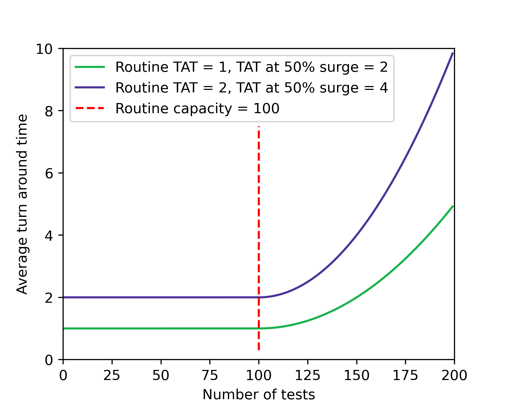
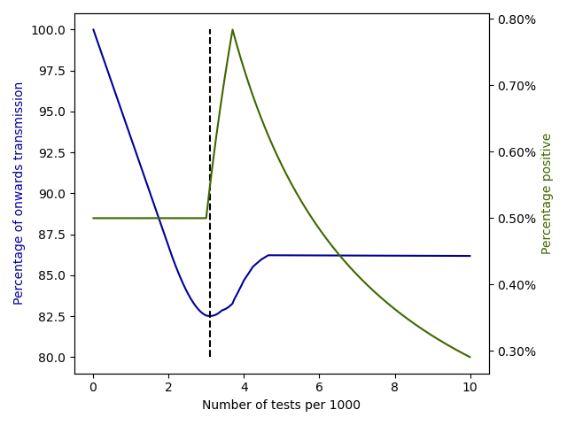

# Optimal allocation of PCR tests to minimise disease transmission through contact tracing and quarantine 

This repository contains python code to replicate the figures in Optimal allocation of PCR tests to minimise disease transmission through contact tracing and quarantine by Christopher M. Baker, Iadine Chades, Jodie McVernon, Andrew Robinson and Howard Bondell.

The code was written in pyton version 3.8 and uses standard libraries including `numpy`, `matplotlib` and `pandas`.

The main module for the analysis is contained in `SimpleModulesModule.py`, while `plotting_code` contains functions used in creating plots.

The main set of figures can be created by running `create_figures.py`. 

The supplmentary figures can be created by running `TAT_UK_MS.py` and `figs_uncertainty.py`.

## Main figures

_**Figure 1**_

_**Figure 2**_

_**Figure 3**_

_**Figure 4**_

_**Figure 5**_

